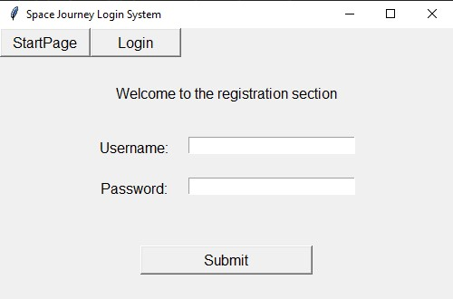
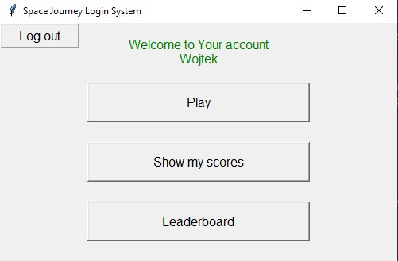
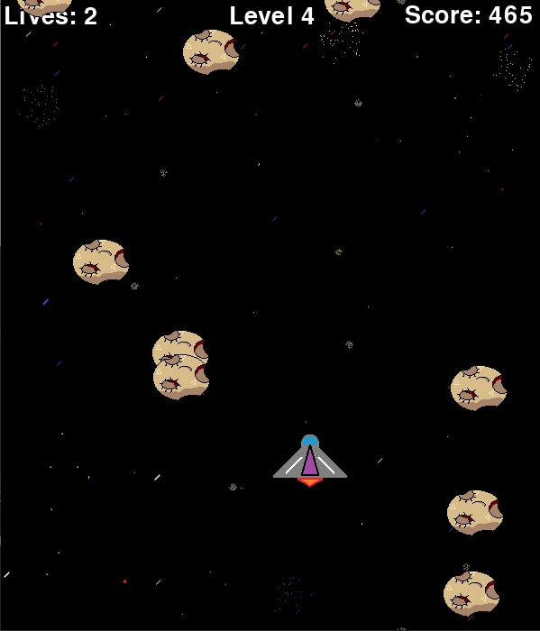

# Space journey
Simple game created with Python 3.8. Contains database in sqlite3 and login system.


## Table of Contents
* [General info](#general-info)
* [Modules](#modules)
* [Setup](#setup)
* [Sources](#sources)


## General info
Space journey is a simple game with login system and database. 

### Login System
Login System is a GUI based on [tkinter](https://docs.python.org/3.8/library/tkinter.html) module.

To use application, first you have to create an account by passing username and password.
Next head to the Login section and repeat these actions.



User section also futures options to check your last scores and display leaderboard.



### Game
Space journey is a game build with a [superwires](https://pypi.org/project/SuperWires/) 
module that is based on [pygame](https://www.pygame.org/news) module, in order to use it you 
need to have them both installed. It also uses [os](https://docs.python.org/3.8/library/os.html)
 and [random](https://docs.python.org/3.8/library/random.html) modules, but those are part od the standard library of Python 3.

The goal is to avoid asteroids. As soon as they disappear from the screen, point will be added to your score.
To navigate the space cruiser use W, S, A, D keys.



### Database
Database is based on a [sqlite3](https://docs.python.org/3.8/library/sqlite3.html) which 
comes with python 3 and you don't have to install it on your own.

Will save data about the user and his scores. Only ten best scores are able to look them up.


## Setup

To install modules use [pip install](https://pip.pypa.io/en/stable/reference/pip_install/).
```
pip install pygame
pip install superwires
pip install tkinter
```

### To start the game follow these instructions:
- Run Login_system.py file.
- Create new account by clicking on a Registration button.
- Click on Login button.
- Insert correct data.
- Enjoy the game by smashing a Play button :)

## Sources

This app is inspired by Michale Dawson book "Python Programming for the Absolute Beginner" 
and [Pygame Tutorial](https://www.youtube.com/watch?v=Q-__8Xw9KTM&t) tutorial by Tim form 
[Tech With Tim](https://www.youtube.com/channel/UC4JX40jDee_tINbkjycV4Sg)


